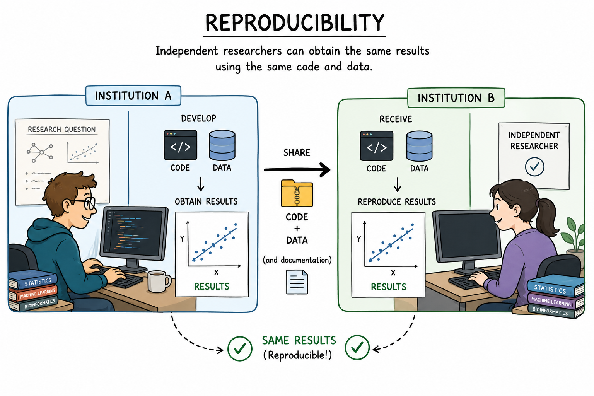

# Reproducible Research Software & Data

The goal of this short demo is to briefly illustrate the challenges associated with making datasets, analyses and outputs reproducible.

## Reproducibility: What?

Reproducibility is the ability of a researcher or independent team to duplicate the exact results of a previous study or experiment using the same raw data, code, methods, and analysis conditions.



## Reproducibility: Why ?

1. **Builds Trust**: When others can repeat your work, it confirms the findings are true and strengthens public confidence in science.
2. **Catches Mistakes**: Testing the same data again helps find hidden errors, calculation flaws, or accidental biases early.
3. **Build on existing work**: Reproducible research allows others to extend analyses rather than starting from scratch.
4. **Accelerate discovery**: Reusable data and software reduce duplicated effort and make collaboration easier.
5. **Improves Transparency**: Sharing raw data and code forces clear record-keeping and open communication.

## Reproducibility: How ?

Here is a non exhaustive practical checklist:

1. **Preserve the data and provenance**
    - Keep the raw data immutable.
    - Document where each dataset came from and how it was obtained.
    - Version datasets when practical, or use tools such as DVC for large datasets.
    - Provide a data dictionary and clear descriptions of variables.

2. **Put all analysis code under version control**. Use Git and make sure the repository contains:
    - analysis code
    - configuration files
    - scripts/workflows
    - tests
    - documentation

3. **Make the pipeline executable end-to-end**. 
    - To avoid human error.
    - This is also easier to run.

4. **Freeze the computational environment**
    - Use package managers, containers or both.

5. **Separate configuration from code**

For example in a separate YAML file.

```yaml
analysis:
  threshold: 0.01
  learning_rate: 0.001
```

6. **Control randomness**
    - Watch the seed

7. **Track experiments and results**

Workflow managers like Nexftlow are great for this.

8. **Test reproducibility before publication**

Someone else (Your PI?) could try to reproduce your results.

!!! warning "Personal Opinion"
    Full reproducibility is difficult and usually an unachievable goal. However... It doesn't mean we shouldn't try our best to reach it.

## Reproducibility Showcase

Let's assume I have created an amazing python script to process some data. Here is my repository Readme.

### Readme

This repository hosts the code to reproduce the analyses for the paper blabla published in blablou.

#### Requirements

Install [Docker](https://docs.docker.com/engine/install/).

#### Reproducing the analysis

To reproduce, from this repository root, run:

```bash
docker run olivierlabayle/cau26reproducibility:0.1.0
```

!!! question "Questions"
    1. Did it work? 
    2. If you run it again, are the results the same?
    3. What are the checklist elements that were well provided ? Those missing?

Now let's see another version, run:

#### Building the Image

```bash
docker build -f assets/Dockerfile_reproducibility -t olivierlabayle/cau26reproducibility:0.1.0 .
```

```bash
git switch reproducible_research_4
```
